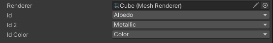
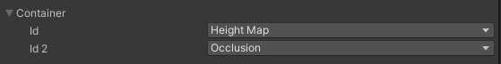
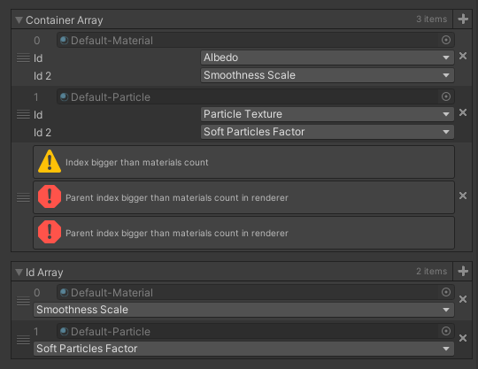

# ShaderPropertyIDAttribute
Attributes for Odin Inspector for drawing dropdown with shader properties from Shader, Material and Renderer

# Usage

## Basic



```cs
// Reference to renderer
[SerializeField] private Renderer m_renderer;

// No parameters
[SerializeField, RendererPropertyID] private string m_id; 

// Point to m_renderer
[SerializeField, RendererPropertyID(nameof(m_renderer))] private string m_id2; 

// Limit property type
[SerializeField, RendererPropertyID(type: ShaderPropertyIDAttributeBase.Type.Color)] private string m_idColor;
```

**RendererPropertyIDAttribute**, **MaterialsPropertyIDAttribute** and **ShaderPropertyIDAttribute** work the same way, except reference type they require.

If reference is **not set**, set to **null** or **empty string*, first reference of proper type found in siblings will be used.
As seen in example **m_id** don't have any parameter set, so it will use **m_renderer** as reference.

Reference string is evaluated just like typical Odin Inspector expresions.

Type can be set to limit which properties should be listed in dropdown.

## Override



```cs
[SerializeField] private Renderer m_renderer;

[Serializable]
public class Container
{
	[SerializeField, RendererPropertyID] private string m_id;
	[SerializeField, RendererPropertyID] private string m_id2; 
}

// Override renderer and type
[SerializeField, RendererPropertyIDRendererOverride, RendererPropertyIDTypeOverride(ShaderPropertyIDAttributeBase.Type.Texture)]
private Container m_container; 
```

With overrides you can override reference and type of child properties and fields.

## RendererPropertyIDParentListAttribute



```cs
[SerializeField] private Renderer m_renderer;

[Serializable]
public class Container
{
	[SerializeField, RendererPropertyID] private string m_id;
	[SerializeField, RendererPropertyID] private string m_id2; 
}

// Apply RendererPropertyIDParentList
[SerializeField, RendererPropertyIDParentList]
private Container[] m_containerArray; 

// Special case for list or array of strings, needs to use RendererPropertyID and RendererPropertyIDParentList
[SerializeField, RendererPropertyIDParentList, RendererPropertyID]
private List<string> m_idArray; 
```

Extra attribute that allows to use all materials from Renderer.

When applied on array or list that contains **string** or class with fields or properties with **RendererPropertyIDAttribute** dropdown will use material of corresponding index from Renderer:
- properties and fields from index 0 will use material from index 0
- properties and fields from index 1 will use material from index 1
- etc.

# Extra folder

This folder contains additional classes that uses these attributes that may be useful for someone.
